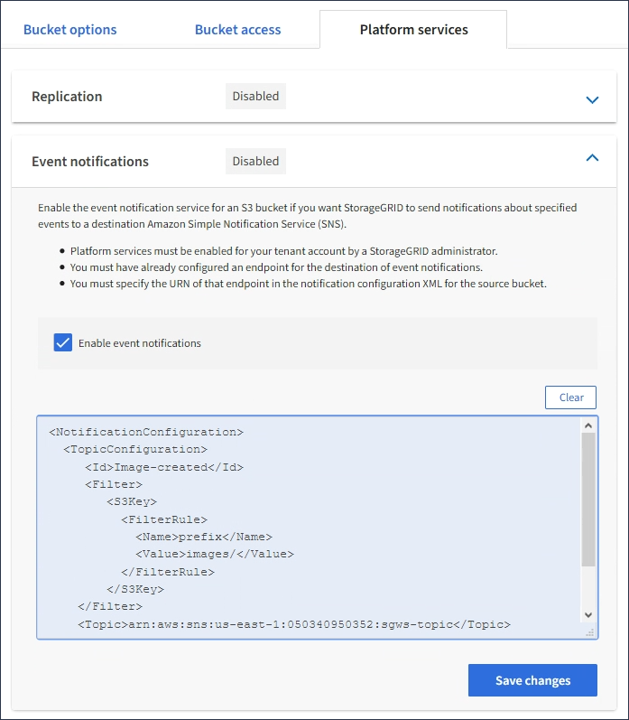

= 設定事件通知
:allow-uri-read: 
:icons: font
:imagesdir: ../media/

[role="lead"]
通知服務是StorageGRID 三種支援的平台服務之一。您可以啟用儲存區通知、將指定事件的相關資訊傳送至支援AWS Simple Notification Service™（SNS）的目的地服務。

.您需要的是 #8217 ；需要的是什麼
* 平台服務必須由StorageGRID 管理員為您的租戶帳戶啟用。
* 您必須已經建立一個儲存區、才能做為通知來源。
* 您要用作事件通知目的地的端點必須已經存在、而且您必須擁有它的URN。
* 您必須屬於具有「管理所有庫位」或「根存取」權限的使用者群組、才能管理租戶帳戶中所有S3庫位的設定。這些權限會在使用租戶管理程式設定儲存區時、覆寫群組或儲存區原則中的權限設定。

設定事件通知之後、每當來源儲存區中的物件發生指定事件時、就會產生通知、並傳送至作為目的地端點的Simple Notification Service（SNS）主題。若要啟用儲存區通知、您必須建立並套用有效的通知組態XML。通知組態XML必須針對每個目的地使用事件通知端點的URN。

如需事件通知及其設定方式的一般資訊、請參閱Amazon文件。如需StorageGRID 瞭解有關如何實作S3儲存區通知組態API的資訊、請參閱實作S3用戶端應用程式的指示。

如果您為包含物件的儲存區啟用事件通知、則通知僅會針對儲存通知組態後所執行的動作傳送。

.步驟
. 啟用來源儲存區的通知：
+
** 使用文字編輯器建立啟用事件通知所需的通知組態XML、如S3通知API所指定。
** 設定XML時、請使用事件通知端點的URN作為目的地主題。

+
[listing]
----
<NotificationConfiguration>
  <TopicConfiguration>
     <Id>Image-created</Id>
     <Filter>
        <S3Key>
          <FilterRule>
            <Name>prefix</Name>
            <Value>images/</Value>
          </FilterRule>
        </S3Key>
    </Filter>
    <Topic>arn:aws:sns:us-east-1:050340950352:sgws-topic</Topic>
    <Event>s3:ObjectCreated:*</Event>
   </TopicConfiguration>
 </NotificationConfiguration>
----
. 在租戶管理程式中、選取*儲存設備（S3）*>*桶*。
. 選取來源儲存區的名稱。
+
此時會顯示「庫位詳細資料」頁面。

. 選擇*平台服務*>*事件通知*。
. 選取*啟用事件通知*核取方塊。
. 將通知組態XML貼到文字方塊中、然後選取*儲存變更*。
+

+

NOTE: 每個租戶帳戶都必須由StorageGRID 使用Grid Manager或Grid Management API的管理員啟用平台服務。如果您儲存組態XML時發生錯誤、請聯絡StorageGRID 您的管理員。

. 確認事件通知設定正確：
+
.. 對來源儲存區中符合觸發通知要求的物件執行動作、如組態XML中所設定。
+
在此範例中、每當建立含有「images/」字首的物件時、就會傳送事件通知。

.. 確認已將通知傳送至目的地SNS主題。
+
例如、如果您的目的地主題是裝載在AWS Simple Notification Service（SNS）上、您可以設定服務在通知送達時傳送電子郵件給您。

+
[listing]
----
{
   "Records":[
      {
         "eventVersion":"2.0",
         "eventSource":"sgws:s3",
         "eventTime":"2017-08-08T23:52:38Z",
         "eventName":"ObjectCreated:Put",
         "userIdentity":{
            "principalId":"1111111111111111111"
         },
         "requestParameters":{
            "sourceIPAddress":"193.51.100.20"
         },
         "responseElements":{
            "x-amz-request-id":"122047343"
         },
         "s3":{
            "s3SchemaVersion":"1.0",
            "configurationId":"Image-created",
            "bucket":{
               "name":"test1",
               "ownerIdentity":{
                  "principalId":"1111111111111111111"
               },
               "arn":"arn:sgws:s3:::test1"
            },
            "object":{
               "key":"images/cat.jpg",
               "size":0,
               "eTag":"d41d8cd98f00b204e9800998ecf8427e",
               "sequencer":"14D90402421461C7"
            }
         }
      }
   ]
}
----

+
如果在目的地主題收到通知、表示您已成功設定來源庫位以供StorageGRID 發出資訊通知。

xref:understanding-notifications-for-buckets.adoc[瞭解庫存箱通知]

xref:../s3/index.adoc[使用S3]

xref:creating-platform-services-endpoint.adoc[建立平台服務端點]
