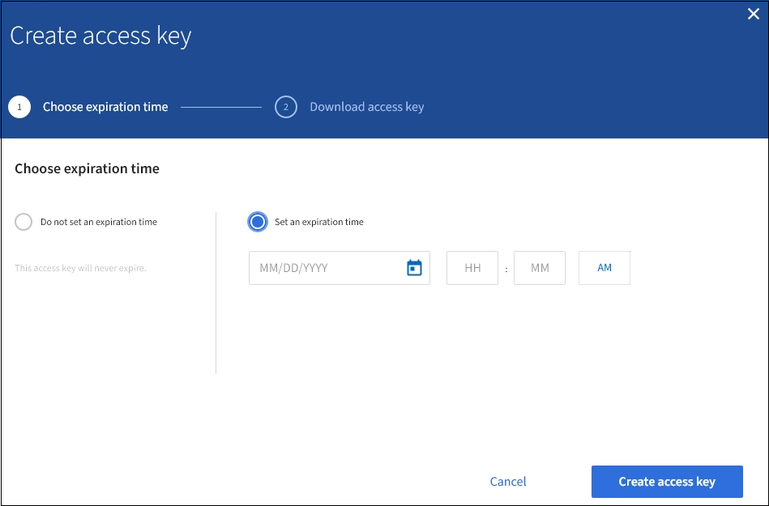

= 建立其他使用者的S3存取金鑰
:allow-uri-read: 
:icons: font
:imagesdir: ../media/

[role="lead"]
如果您使用的是S3租戶、而且您擁有適當的權限、則可以為其他使用者建立S3存取金鑰、例如需要存取儲存區和物件的應用程式。

.您需要的產品
* 您必須使用登入租戶管理程式 xref:../admin/web-browser-requirements.adoc[支援的網頁瀏覽器]。
* 您必須具有「根存取」權限。

.關於這項工作
您可以為其他使用者建立一或多個S3存取金鑰、以便他們為租戶帳戶建立及管理貯體。建立新的存取金鑰之後、請使用新的存取金鑰ID和秘密存取金鑰來更新應用程式。為了安全起見、請勿建立超過使用者需求的金鑰、並刪除未使用的金鑰。如果您只有一個金鑰即將過期、請在舊金鑰過期之前建立新金鑰、然後刪除舊金鑰。

每個金鑰都可以有特定的到期時間、或是沒有到期時間。請遵循下列到期時間準則：

* 設定金鑰的到期時間、以限制使用者存取特定時間段。如果存取金鑰ID和秘密存取金鑰意外暴露、設定短的過期時間有助於降低風險。過期的金鑰會自動移除。
* 如果環境中的安全風險很低、而且您不需要定期建立新金鑰、則不必設定金鑰的到期時間。如果您決定稍後再建立新金鑰、請手動刪除舊金鑰。

IMPORTANT: 您可以使用租戶管理程式中顯示的該使用者存取金鑰ID和秘密存取金鑰、來存取屬於該使用者的S3儲存區和物件。因此、請像保護密碼一樣保護存取金鑰。定期旋轉存取金鑰、從帳戶中移除任何未使用的金鑰、而且切勿與其他使用者共用。

.步驟
. 選擇*存取管理*>*使用者*。
. 選取您要管理其S3存取金鑰的使用者。
+
使用者詳細資料頁面隨即出現。

. 選取*存取金鑰*、然後選取*建立金鑰*。
. 執行下列其中一項：
+
** 選取*「不要設定到期時間*」以建立不會過期的金鑰。（預設）
** 選取*設定到期時間*、然後設定到期日和時間。
+

. 選取*建立存取金鑰*。
+
此時會出現「下載存取金鑰」對話方塊、列出存取金鑰ID和秘密存取金鑰。

. 將存取金鑰ID和秘密存取金鑰複製到安全位置、或選取*下載.csv*以儲存內含存取金鑰ID和秘密存取金鑰的試算表檔案。
+

IMPORTANT: 在複製或下載此資訊之前、請勿關閉此對話方塊。您無法在對話方塊關閉後複製或下載金鑰。

+
image::../media/tenant_s3_access_key_save_keys.png[儲存金鑰對話方塊的快照]

. 選擇*完成*。
+
新金鑰會列在使用者詳細資料頁面的「存取金鑰」索引標籤上。由於快取、變更可能需要15分鐘才能生效。

.相關資訊
xref:tenant-management-permissions.adoc[租戶管理權限]
