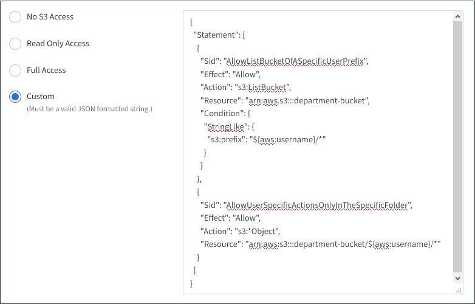

= 為S3租戶建立群組
:allow-uri-read: 
:icons: font
:imagesdir: ../media/

[role="lead"]
您可以匯入同盟群組或建立本機群組、來管理S3使用者群組的權限。

.您需要的產品
* 您必須使用登入租戶管理程式 xref:../admin/web-browser-requirements.adoc[支援的網頁瀏覽器]。
* 您必須屬於具有「根存取」權限的使用者群組。請參閱 xref:tenant-management-permissions.adoc[租戶管理權限]。
* 如果您打算匯入聯盟群組、表示您已設定身分識別聯盟、而且聯盟群組已存在於設定的身分識別來源中。

如需S3的相關資訊、請參閱 xref:../s3/index.adoc[使用S3]。

.步驟
. 選擇*存取管理*>*群組*。
+
image::../media/tenant_add_groups_example.png[顯示「存取控制」>「群組」頁面的快照]

. 選取*建立群組*。
. 選取*本機群組*索引標籤以建立本機群組、或選取*聯盟群組*索引標籤、從先前設定的身分識別來源匯入群組。
+
如果StorageGRID 您的系統啟用單一登入（SSO）、屬於本機群組的使用者將無法登入租戶管理程式、不過他們可以根據群組權限、使用用戶端應用程式來管理租戶的資源。

. 輸入群組名稱。
+
** *本機群組*：輸入顯示名稱和唯一名稱。您可以稍後再編輯顯示名稱。
** *聯盟群組*：輸入唯一名稱。對於Active Directory、唯一名稱是與「shamAccountName」屬性相關聯的名稱。對於OpenLDAP、唯一名稱是與「uid」屬性相關聯的名稱。

. 選擇*繼續*。
. 選取存取模式。如果使用者屬於多個群組、且任何群組設定為唯讀、則使用者將擁有所有選取設定和功能的唯讀存取權。
+
** *讀寫*（預設）：使用者可以登入租戶管理程式、並管理租戶組態。
** *唯讀*：使用者只能檢視設定和功能。他們無法在租戶管理程式或租戶管理API中進行任何變更或執行任何作業。本機唯讀使用者可以變更自己的密碼。

. 選取此群組的群組權限。
+
請參閱租戶管理權限的相關資訊。

. 選擇*繼續*。
. 選取群組原則、以判斷此群組成員將擁有哪些S3存取權限。
+
** *無S3存取*：預設。此群組中的使用者沒有S3資源的存取權、除非使用資源桶原則授予存取權。如果選取此選項、預設只有root使用者可以存取S3資源。
** *唯讀存取*：此群組中的使用者擁有S3資源的唯讀存取權。例如、此群組中的使用者可以列出物件並讀取物件資料、中繼資料和標記。選取此選項時、唯讀群組原則的Json字串會出現在文字方塊中。您無法編輯此字串。
** *完整存取*：此群組中的使用者可完整存取S3資源、包括儲存區。選取此選項時、會在文字方塊中顯示完整存取群組原則的Json字串。您無法編輯此字串。
** *自訂*：群組中的使用者會被授予您在文字方塊中指定的權限。如需群組原則的詳細資訊、包括語言語法和範例、請參閱實作S3用戶端應用程式的指示。

. 如果您選取*自訂*、請輸入群組原則。每個群組原則的大小上限為5、120位元組。您必須輸入有效的Json格式字串。
+
在此範例中、群組成員只能列出及存取符合其使用者名稱（金鑰前置碼）的資料夾、並在指定的儲存區中使用。請注意、在決定這些資料夾的隱私權時、應考慮其他群組原則和儲存區原則的存取權限。

+

. 根據您要建立同盟群組或本機群組、選取出現的按鈕：
+
** 聯盟群組：*建立群組*
** 本機群組：*繼續*

+
如果您要建立本機群組、在您選取*繼續*之後、會出現步驟4（新增使用者）。聯盟群組不會顯示此步驟。

. 選取您要新增至群組的每個使用者核取方塊、然後選取*建立群組*。
+
您也可以選擇儲存群組、而不新增使用者。您可以稍後新增使用者至群組、或在新增使用者時選取群組。

. 選擇*完成*。
+
您建立的群組會出現在群組清單中。由於快取、變更可能需要15分鐘才能生效。

