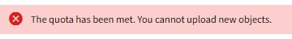

= 瞭解租戶管理程式儀表板
:allow-uri-read: 
:icons: font
:imagesdir: ../media/

[role="lead"]
租戶管理程式儀表板提供租戶帳戶組態的總覽、以及租戶貯體（S3）或容器（Swift）中物件所使用的空間量。如果租戶有配額、儀表板會顯示配額使用量及剩餘量。如果有任何與租戶帳戶相關的錯誤、則錯誤會顯示在儀表板上。

IMPORTANT: 「已用空間」值為預估值。這些預估值會受到擷取時間、網路連線能力和節點狀態的影響。

物件上傳後、儀表板的範例如下所示：

image::../media/tenant_dashboard_with_buckets.png[儀表板-目標清單]

== 租戶帳戶摘要

儀表板頂端包含下列資訊：

* 已設定的儲存區或容器、群組和使用者數量
* 平台服務端點的數量（若有）

您可以選取連結來檢視詳細資料。

儀表板右側包含下列資訊：

* 租戶的物件總數。
+
對於S3帳戶、如果沒有任何物件被擷取、而且您具有「根存取」權限、則會顯示「入門指南」、而非物件總數。

* 租戶詳細資料、包括租戶帳戶名稱和ID、以及租戶是否可以使用 xref:what-platform-services-are.adoc[平台服務]、 xref:../admin/using-identity-federation.adoc[其本身的身分識別來源]或 xref:../admin/manage-s3-select-for-tenant-accounts.adoc[S3 Select] （僅列出已啟用的權限）。

== 儲存設備與配額使用量

「儲存設備」使用面板包含下列資訊：

* 租戶的物件資料量。
+

IMPORTANT: 此值表示上傳的物件資料總數量、不代表用來儲存這些物件複本及其中繼資料的空間。

* 如果已設定配額、則為物件資料可用的空間總量、以及剩餘空間的數量和百分比。配額會限制可擷取的物件資料量。
+

IMPORTANT: 配額使用率是根據內部預估、在某些情況下可能會超過。例如StorageGRID 、當租戶開始上傳物件時、會檢查配額、如果租戶超過配額、則會拒絕新的擷取。不過StorageGRID 、判斷是否超過配額時、不考慮目前上傳的大小。如果刪除物件、則在重新計算配額使用率之前、租戶可能會暫時無法上傳新物件。配額使用率計算可能需要10分鐘或更長時間。

* 代表最大桶或容器之相對大小的長條圖。
+
您可以將游標放在任何圖表區段上、以檢視該區段或容器所耗用的總空間。

+
image::../media/tenant_dashboard_storage_usage_segment.png[長條圖區段]

* 若要對應長條圖、請列出最大的貯體或容器清單、包括物件資料的總數量、以及每個貯體或容器的物件數目。
+
image::../media/tenant_dashboard_buckets.png[租戶儀表板鏟斗]

+
如果租戶擁有超過九個貯體或容器、則所有其他貯體或容器都會合併成清單底部的單一項目。

== 配額使用量警示

如果已在Grid Manager中啟用配額使用量警示、則當配額不足或超出時、這些警示會出現在Tenant Manager中、如下所示：

如果已使用90%以上的租戶配額、則會觸發*租戶配額使用量高*警示。如需詳細資訊、請參閱監控StorageGRID 和疑難排解功能的說明中的警示參考資料。

image::../media/tenant_dashboard_quota_remaining.png[剩餘租戶儀表板配額]

如果超出配額、就無法上傳新物件。

NOTE: 若要檢視其他詳細資料、並管理警示的規則和通知、請參閱監控和疑難排解StorageGRID 的指示。

== 端點錯誤

如果您已使用Grid Manager設定一或多個端點以搭配平台服務使用、則租戶管理程式儀表板會在過去七天內發生任何端點錯誤時顯示警示。

image::../media/tenant_dashboard_endpoint_error.png[顯示端點訊息的儀表板]

若要查看端點錯誤的詳細資料、請選取「端點」以顯示「端點」頁面。

xref:troubleshooting-platform-services-endpoint-errors.adoc[疑難排解平台服務端點錯誤]

xref:../monitor/index.adoc[監控及疑難排解]
