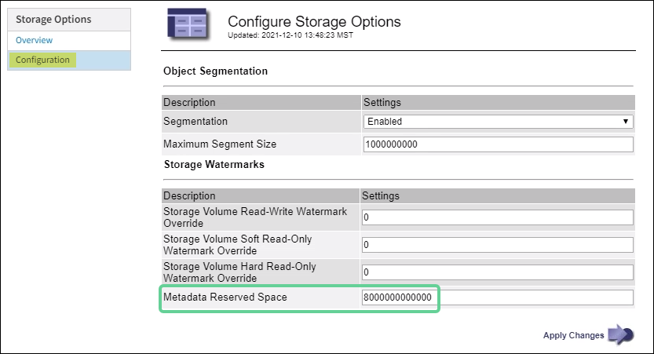

= 增加中繼資料保留空間設定
:allow-uri-read: 
:icons: font
:imagesdir: ../media/

[role="lead"]
升級StorageGRID 至版本4的11.6,如果您的儲存節點符合RAM和可用空間的特定需求,您可能可以增加中繼資料保留空間系統設定。

.您需要的是 #8217 ；需要的是什麼
* 您必須使用登入Grid Manager xref:../admin/web-browser-requirements.adoc[支援的網頁瀏覽器]。
* 您必須具有「根存取」權限或「網格拓撲頁面組態」和「其他網格組態」權限。
* 您已經完成StorageGRID 了更新版的更新。

升級StorageGRID 至版本11.6之後、您可能可以手動將系統範圍的中繼資料保留空間設定增加至8 TB。在執行11.6%升級之後保留額外的中繼資料空間、將可簡化未來的硬體與軟體升級。

只有當這兩個陳述均為真時、您才能增加全系統中繼資料保留空間設定的值：

* 系統中任何站台的儲存節點都有128 GB以上的RAM。
* 系統中任何站台的儲存節點、在儲存Volume 0上都有足夠的可用空間。

請注意、如果您增加此設定、您將會同時減少所有儲存節點之儲存Volume 0上的物件儲存可用空間。因此、您可能偏好根據預期的物件中繼資料需求、將中繼資料保留空間設為小於8 TB的值。

NOTE: 一般而言、最好使用較高的值、而非較低的值。如果「中繼資料保留空間」設定太大、您可以稍後再加以減少。相反地、如果您稍後增加值、系統可能需要移動物件資料以釋放空間。

如需中繼資料保留空間設定如何影響特定儲存節點上物件中繼資料儲存所允許空間的詳細說明、請參閱 xref:../admin/managing-object-metadata-storage.adoc[管理物件中繼資料儲存]。

.步驟
. 使用登入Grid Manager xref:../admin/web-browser-requirements.adoc[支援的網頁瀏覽器]。
. 判斷目前的中繼資料保留空間設定。
+
.. 選擇*組態*>*系統*>*儲存選項*。
.. 在「Storage Watermarks（儲存浮點）」區段中、記下*中繼資料保留空間*的值。

. 確保每個儲存節點的儲存Volume 0上有足夠的可用空間來增加此值。
+
.. 選擇*節點*。
.. 選取網格中的第一個儲存節點。
.. 選取「Storage（儲存）」索引標籤。
.. 在Volumes（磁碟區）區段中、找到*/var/local/rangedb/0*項目。
.. 確認可用值等於或大於您要使用的新值與目前中繼資料保留空間值之間的差異。
+
例如、如果中繼資料保留空間設定目前為4 TB、而您想要將其增加至6 TB、則可用值必須為2 TB或更大。

.. 對所有儲存節點重複這些步驟。
+
*** 如果一個或多個儲存節點沒有足夠的可用空間、則無法增加中繼資料保留空間值。請勿繼續執行此程序。
*** 如果每個儲存節點在Volume 0上有足夠的可用空間、請前往下一步。

. 確保每個儲存節點上至少有128 GB的RAM。
+
.. 選擇*節點*。
.. 選取網格中的第一個儲存節點。
.. 選取*硬體*索引標籤。
.. 將游標暫留在「記憶體使用量」圖表上。確保*總記憶體*至少128 GB。
.. 對所有儲存節點重複這些步驟。
+
*** 如果一個或多個儲存節點沒有足夠的可用總記憶體、則無法增加中繼資料保留空間值。請勿繼續執行此程序。
*** 如果每個儲存節點的總記憶體容量至少為128 GB、請執行下一步。

. 更新中繼資料保留空間設定。
+
.. 選擇*組態*>*系統*>*儲存選項*。
.. 選取「組態」索引標籤。
.. 在「Storage Watermarks（儲存浮點）」區段中、選取*中繼資料保留空間*。
.. 輸入新值。
+
例如、若要輸入最大支援值8 TB、請輸入* 80000000000000000*（8、接著12個零）

+

.. 選取*套用變更*。

