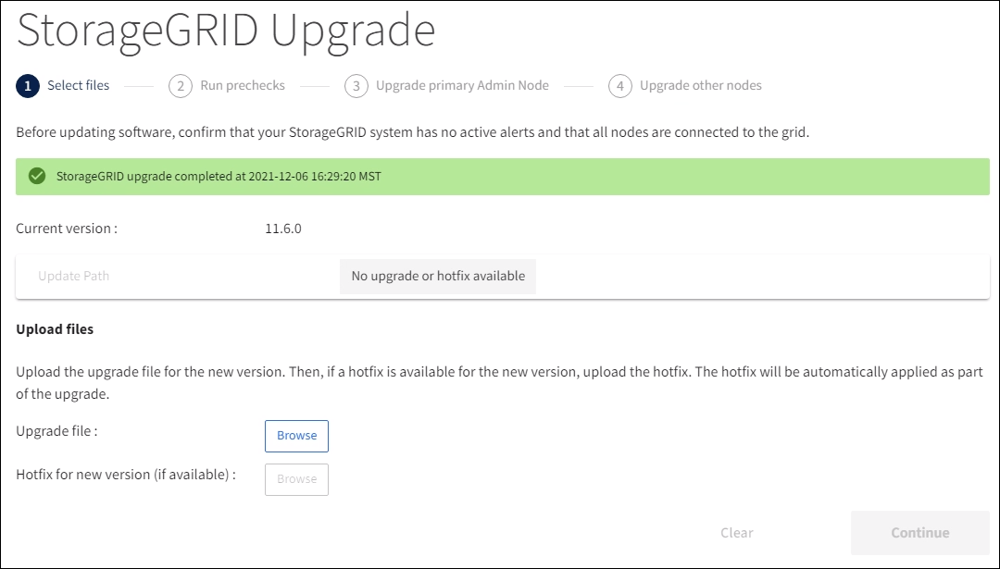

= 執行升級
:allow-uri-read: 
:icons: font
:imagesdir: ../media/

[role="lead"]
當您準備好執行升級時、請選取「.升級」歸檔、然後輸入資源配置通關密碼。您可以選擇在執行實際升級之前執行升級前置檢查。

您已檢閱所有考量事項、並完成所有規劃與準備步驟。

== 上傳升級檔案

. 使用登入Grid Manager xref:../admin/web-browser-requirements.adoc[支援的網頁瀏覽器]。
. 選擇*維護*>*系統*>*軟體更新*。
+
此時會出現「軟體更新」頁面。

. 選擇* StorageGRID 《Upgrade》*。
. 在「更新版」頁面上、選取「.Upgrade」歸檔。StorageGRID
+
.. 選擇*瀏覽*。
.. 找到並選取檔案：「NetApp_StorageGRID_11.6.0_Software_uniqueID.Upgrade」
.. 選取*「Open*（開啟*）」。
+
檔案已上傳並驗證。驗證程序完成後、升級檔案名稱旁會出現綠色勾號。

. 在文字方塊中輸入資源配置通關密碼。
+
*執行預先檢查*和*開始升級*按鈕會啟用。

+
image::../media/storagegrid_upgrade_buttons_enabled.png[支援的更新按鈕StorageGRID]

== 執行預先檢查

您也可以選擇在開始實際升級之前驗證系統的狀況。選取*執行預先檢查*可讓您在開始升級之前偵測並解決問題。當您開始升級時、也會執行相同的預先檢查。預先檢查失敗將會停止升級程序、有些可能需要技術支援人員介入才能解決問題。

. 選取*執行預先檢查*。
. 等待預先檢查完成。
. 請依照指示來解決所報告的任何預先檢查錯誤。
+

IMPORTANT: 如果您已開啟任何自訂防火牆連接埠、系統會在預先檢查驗證期間通知您。您必須先聯絡技術支援部門、才能繼續升級。

== 開始升級及更新主要管理節點

當升級開始時、系統會執行升級前置檢查、並升級主要管理節點、包括停止服務、升級軟體及重新啟動服務。當主要管理節點正在升級時、您無法存取Grid Manager。稽核記錄也無法使用。此升級可能需要30分鐘。

. 當您準備好執行升級時、請選取*開始升級*。
+
此時會出現一則警告、提醒您當主要管理節點重新開機時、瀏覽器的連線將會中斷。

+
image::../media/software_upgrade_connection_will_be_lost.png[軟體升級連線將會中斷]

. 選擇*確定*以確認警告並開始升級程序。
. 等待執行升級前置檢查、並讓主要管理節點升級。
+

NOTE: 如果報告任何預先檢查錯誤、請解決這些錯誤、然後再次選取*開始升級*。

+
在升級主管理節點時、會出現多個* 503：服務無法使用*和*連線至伺服器*訊息時出現問題、您可以忽略這些訊息。

+
image::../media/software_upgrade_503_error.png[軟體升級503錯誤]

+
image::../media/software_upgrade_problem_connecting_error.png[軟體升級問題連線錯誤]

. 當您看到「*400：不良要求*」訊息時、請前往下一步。管理節點升級完成。
+
image::../media/software_upgrade_400_error.png[軟體升級400錯誤]

== 清除瀏覽器快取並重新登入

. 升級主要管理節點之後、請清除網頁瀏覽器的快取並重新登入。
+
如需相關指示、請參閱網頁瀏覽器的說明文件。

+

IMPORTANT: 您必須清除網頁瀏覽器的快取、才能移除舊版軟體所使用的過時資源。

+
重新設計的Grid Manager介面隨即出現、表示主要管理節點已升級。

+
image::../media/grid_manager_dashboard.png[Grid Manager儀表板]

. 從側邊列選取* maintenance *以開啟「維護」功能表。
. 在* System*區段中、選取* Software update*。
. 在* StorageGRID 《Upgrade》（*更新*）區段中、選取* Upgrade（*升級*）。
. 請檢閱StorageGRID 「VMware升級」頁面上的「升級進度」區段、其中提供每項重大升級工作的相關資訊。
+
.. *「開始升級服務」*是第一項升級工作。在此工作期間、軟體檔案會發佈至網格節點、並啟動升級服務。
.. 當*開始升級服務*工作完成時、*升級網格節點*工作就會啟動。
.. 當*升級網格節點*工作進行中時、網格節點狀態表會出現、並顯示系統中每個網格節點的升級階段。

== 下載恢復套件並升級所有網格節點

. 網格節點出現在「Grid Node Status（網格節點狀態）」表格中、但在核准任何網格節點之前、 xref:obtaining-required-materials-for-software-upgrade.adoc#download-the-recovery-package[下載新的恢復套件複本]。
+

IMPORTANT: 在主管理節點上升級軟體版本之後、您必須下載新的恢復套件檔案複本。恢復套件檔案可讓您在發生故障時還原系統。

. 檢閱網格節點狀態表中的資訊。網格節點會依類型分成多個區段：管理節點、API閘道節點、儲存節點和歸檔節點。
+
image::../media/software_upgrade_start_grid_node_status.png[管理節點完成後升級網格節點的快照]

+
當第一次顯示此頁面時、網格節點可以處於下列其中一個階段：

+
** 完成（僅限主要管理節點）
** 正在準備升級
** 軟體下載排入佇列
** 正在下載
** 正在等待您核准

. 核准已準備好新增至升級佇列的網格節點。
+

IMPORTANT: 在網格節點上開始升級時、該節點上的服務會停止。之後、網格節點會重新開機。為了避免與節點通訊的用戶端應用程式發生服務中斷、除非您確定節點已準備好停止並重新開機、否則請勿核准節點的升級。視需要排程維護時段或通知客戶。

+
您必須升級StorageGRID 您的整個作業系統中的所有網格節點、但您可以自訂升級順序。您可以核准個別的網格節點、網格節點群組或所有網格節點。

+
如果節點升級順序很重要、請一次核准一個節點或節點群組、並等到每個節點上的升級完成後、再核准下一個節點或節點群組。

+
** 選取一或多個*核准*按鈕、將一個或多個個別節點新增至升級佇列。如果您核准多個相同類型的節點、則節點將一次升級一個。
** 選取每個區段中的*「核准全部*」按鈕、將同類型的所有節點新增至升級佇列。
** 選取「頂層*全部核准*」按鈕、將網格中的所有節點新增至升級佇列。
** 選取*移除*或*全部移除*、即可從升級佇列移除節點或所有節點。當節點的「階段」達到*停止服務*時、您無法移除該節點。「*移除*」按鈕會隱藏。
+
image::../media/software_upgrade_two_nodes_queued.png[顯示「分級」正在停止服務的螢幕擷取畫面]

. 等待每個節點繼續執行升級階段、包括佇列、停止服務、停止容器、清除Docker映像、升級基礎OS套件、重新開機、重新開機後執行步驟、啟動服務及完成。
+

NOTE: 當應用裝置節點達到「升級基礎作業系統套件」階段時、StorageGRID 應用裝置上的《支援應用程式安裝程式軟體」將會更新。此自動化程序可確保StorageGRID SynsanceAppliance Installer版本與StorageGRID 支援的更新版本保持同步。

== 完整升級

當所有網格節點都完成升級階段後、*升級網格節點*工作會顯示為已完成。其餘的升級工作會在背景中自動執行。

. 一旦*啟用功能*工作完成（很快就會發生）、您可以選擇開始使用升級StorageGRID 版的更新版更新功能。
. 在*升級資料庫*工作期間、升級程序會檢查每個節點、以確認不需要更新Cassandra資料庫。
+

NOTE: 從還原11.5升級StorageGRID 至11.6%不需要Cassandra資料庫升級、不過、Cassandra服務會在每個儲存節點上停止並重新啟動。對於未來StorageGRID 的版本、Cassandra資料庫更新步驟可能需要幾天的時間才能完成。

. 當*升級資料庫*工作完成時、請等待幾分鐘、*最終升級步驟*工作才會完成。
+
完成「最終升級步驟」工作後、即會完成升級。

== 確認升級

. 確認升級成功完成。
+
.. 從Grid Manager頂端、選取說明圖示、然後選取*關於*。
.. 確認顯示的版本符合您的期望。
.. 選擇*維護*>*系統*>*軟體更新*。
.. 在* StorageGRID 《升級*》區段中、選取*升級*。
.. 確認綠色橫幅顯示軟體升級已在您預期的日期和時間完成。
+

. 從「更新版」頁面、判斷目前版本的任何即時修復程式是否可用。StorageGRID StorageGRID
+

NOTE: 如果未顯示更新路徑、您的瀏覽器可能無法連線至NetApp支援網站。或者AutoSupport 、可能AutoSupport 會停用「支援」頁面（*支援*>*工具*>*鏡像*）上的「*檢查軟體更新*」核取方塊。

. 如果有可用的修補程式、請下載檔案。然後使用 xref:../maintain/storagegrid-hotfix-procedure.adoc[修復程序StorageGRID] 以套用修補程式。
. 確認網格作業已恢復正常：
+
.. 檢查服務是否正常運作、以及是否沒有非預期的警示。
.. 確認用戶端連線StorageGRID 至該系統的運作正常。

